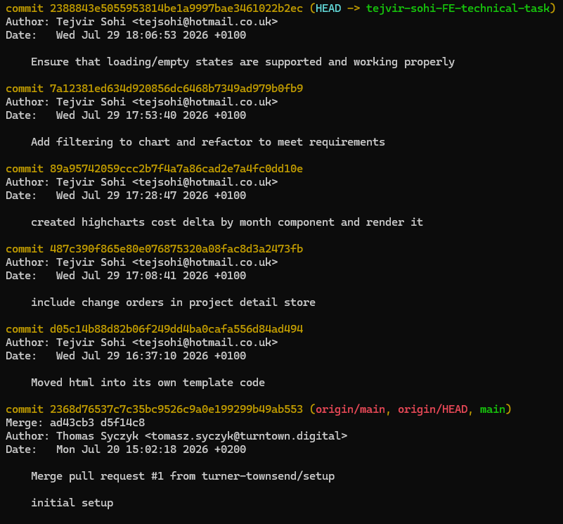

## Pre-brief
This soloution took a maximum of 90 minutes from 4:37pm to 6:06pm, once I had verified pre-requisites tools were installed and the application could run locally.

Proof of time taken with commit messages

## What I built
- Created a highcharts line chart component showcasing the cumulative cost delta by month over a period of time
- Added a status filter to the above mentioned component
- Ensure that loading and empty state was handled. Failed state was not handled.

## Trade-offs, decisions and what I would do with more time
- Unit testing specifically the filterChangeOrders and toCumulativeByMonth methods. This didn't happen due to lack of time.
- Failed state not handled due to lack of time. This scenario could potentially happen if the API fails to return a succuessful response and the user needs to be correctly informed that there is an internal issue, not something they have done wrong.
- Move the `project-detail.component` templating into it's own file in `project-detail.component.html`. This allows for better readability and an improved developer experience.
- Made use of a mat-select rather than vanilla html select, since this is a used technology at T&T
- Made use of the new Angular control flow syntax in templates.
- Possibly instead of loading spinners, making use of skeleton loaders, mainly on the highcharts components because even with no throttling they do not load instantly. 

## AI Usuage
- Used Github co-pilot to assist with understanding the codebase, domain and what was located where like models and how the store interacts with the various files and with the writing of some logic in the store.

