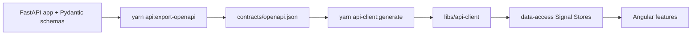

# Base App Architecture

Target structure for the shipped repo. It is an Nx monorepo containing the Angular app,
a generated OpenAPI client, and a Python FastAPI service, with Postgres via Docker.

## Workspace layout

```text
project-controls-hub/
  apps/
    hub/                      # Angular 21 application (standalone, signals)
    hub-e2e/                  # Cypress end-to-end project
    api/                      # FastAPI service (Python 3.12)
  libs/
    api-client/               # OpenAPI-generated TypeScript client (do not hand-edit)
    domain/                   # Shared FE domain models + mappers
    feature-portfolio/        # Portfolio list feature (existing)
    feature-project-detail/   # Project detail: cost trend, milestones, benchmark (existing)
    data-access/              # NgRx Signal Stores + facades
    ui/                       # Reusable Material + Tailwind UI components
  contracts/
    openapi.json              # Exported from FastAPI (yarn api:export-openapi)
  infra/
    docker-compose.yml        # api + postgres + seed
    k8s/                      # reference manifests (discussion-level)
  tools/
    seed/                     # deterministic seed loader (reads contracts/seed-data.json)
  nx.json
  package.json
```

## Backend service (`apps/api`)

```text
apps/api/
  app/
    main.py                   # FastAPI app, router registration, OpenAPI metadata
    api/                      # routers: projects, change_orders, benchmarks, health
    domain/                   # pydantic models + business logic (variance, impact)
    db/                       # SQLAlchemy models, session, migrations (alembic)
  tests/                      # pytest integration + unit tests
  pyproject.toml
```

- **OpenAPI from FastAPI:** routes and Pydantic models define the API; export with
  `yarn api:export-openapi` writes `contracts/openapi.json`.
  Regenerate the Angular client with `yarn api-client:generate`.
- **Postgres** holds all domain data; Alembic manages migrations.

## Frontend app (`apps/hub`)

- Angular 21 standalone components, `inject()`, signal inputs/outputs, control-flow blocks.
- **NgRx Signal Store** is the primary state mechanism (`signalStore`, `withState`,
  `withComputed`, `withMethods`); feature state lives in `libs/data-access`.
- **Material + Tailwind** for layout/styling; **Highcharts** for cost/schedule/benchmark charts.
- **Typed API access** only through `libs/api-client` (generated). No hand-written fetch calls.
- **Testing:** Vitest for unit/component, Cypress for e2e in `apps/hub-e2e`.

## OpenAPI-first client generation flow



When you add or change an endpoint: update the FastAPI code -> run `yarn api-client:generate`
(export + TypeScript types) -> consume in a store.

## Local run

Prerequisites: [Volta](https://volta.sh) (pins Node 22 + Yarn 4 — see README), Docker, [uv](https://docs.astral.sh/uv/) (only if running the API outside Docker).

```bash
docker compose -f infra/docker-compose.yml up --build   # api:8000; postgres on host :5433
yarn install
yarn api-client:generate                                 # refresh typed client types
yarn nx serve hub                                         # app on http://localhost:4200
```

Tests:

```bash
yarn nx test hub                                # Vitest unit/component
yarn nx e2e hub-e2e                             # Cypress (needs the app + API running)
cd apps/api && uv sync && uv run pytest         # API tests
yarn api:lint                                   # Ruff + mypy (from repo root, after uv sync)
```

Notes:

- The Angular app is **zoneless** (`provideZonelessChangeDetection`) and uses standalone
  components + signals throughout; there is no `zone.js` polyfill.
- Styling uses **Tailwind v4** (CSS-first via `@import "tailwindcss"` + `@tailwindcss/postcss`)
  alongside an Angular Material prebuilt theme.
- Highcharts is provided through DI with `provideHighcharts(...)` (highcharts-angular v5).

## Kubernetes (discussion-level)

`infra/k8s/` holds reference manifests (Deployment, Service, ConfigMap, HPA). Candidates
are not asked to deploy; Mid backend candidates may discuss or sketch manifest changes as a
bonus during the code-review stage.
