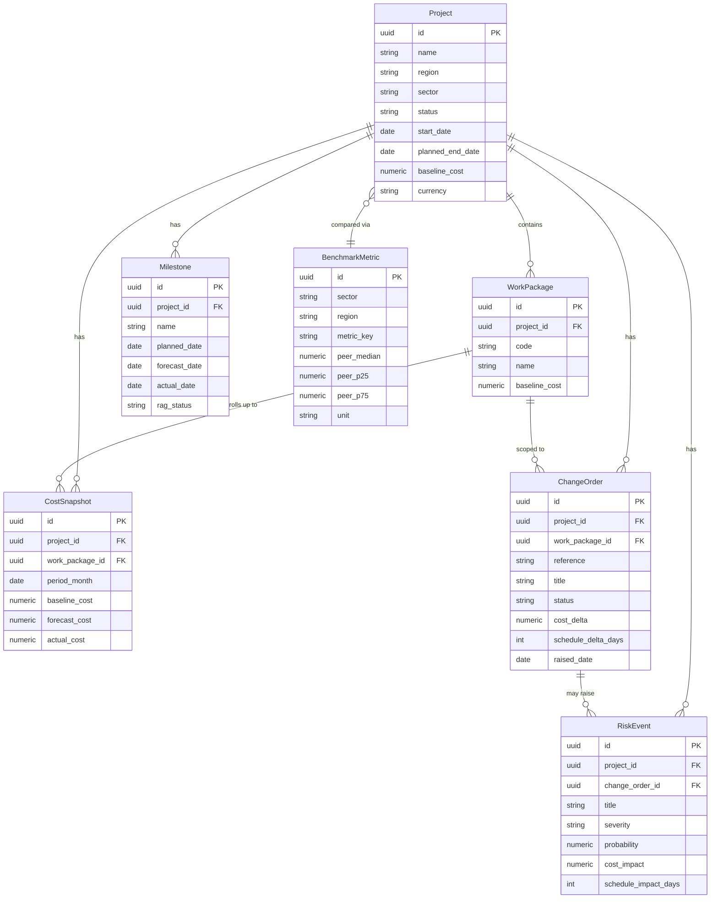

# Domain Model: Project Controls Hub

The domain is intentionally compact but realistic for construction project controls.
Unfamiliar terms? See the [business glossary](../business-glossary.md).

All entities, fields, and relationships below are the shared contract that briefs,
the API ([`contracts/openapi.json`](contracts/openapi.json)), the schema
([`contracts/schema.sql`](contracts/schema.sql)), and seed data
([`contracts/seed-data.json`](contracts/seed-data.json)) must agree on.

## Entity relationship diagram

## Entities

### Project
A construction project under management. Headline entity for the portfolio.
- `status`: one of `planning`, `in_delivery`, `on_hold`, `complete`.
- `baseline_cost` is the approved budget at sanction; `currency` is ISO 4217.

### WorkPackage
A subdivision of a project's scope (e.g. "Substructure", "MEP"). Costs and change
orders roll up to the project through work packages.

### CostSnapshot
Monthly cost position per project (and optionally per work package). Holds
`baseline_cost`, `forecast_cost`, and `actual_cost` for `period_month`. This powers the
cost trend chart and variance calculations.

### Milestone
A schedule checkpoint with `planned_date`, `forecast_date`, `actual_date`, and a
`rag_status` (`red` | `amber` | `green`). Drives the schedule view and slippage metrics.

### RiskEvent
A risk or issue with `severity` (`low` | `medium` | `high` | `critical`), `probability`
(0-1), `cost_impact`, and `schedule_impact_days`. May be linked to a `ChangeOrder`.

### ChangeOrder
A formal scope/cost/schedule change. Carries `cost_delta` and `schedule_delta_days` and a
`status` (`draft` | `submitted` | `approved` | `rejected`). Several candidate tasks center
on creating change orders and recomputing project impact.

### BenchmarkMetric
Peer-project reference values for a `sector` + `region` + `metric_key`
(e.g. `cost_per_m2`), with `peer_median`, `peer_p25`, `peer_p75`. Powers the benchmark panel.

## Derived values (used by tasks)

These are not stored; they are computed and several briefs ask candidates to implement them.

| Derived value | Definition |
| --- | --- |
| Cost variance | `actual_cost - baseline_cost` for a period or cumulative. |
| Cost variance % | `(actual_cost - baseline_cost) / baseline_cost`. |
| Forecast at completion (simple) | `baseline_cost + sum(approved change_order.cost_delta)`. |
| Schedule slippage (days) | `forecast_date - planned_date` (or `actual_date - planned_date`). |
| Change-order impact | aggregate `cost_delta` and `schedule_delta_days` of `approved` orders. |
| Benchmark position | where a project metric sits relative to `peer_p25/median/p75`. |

